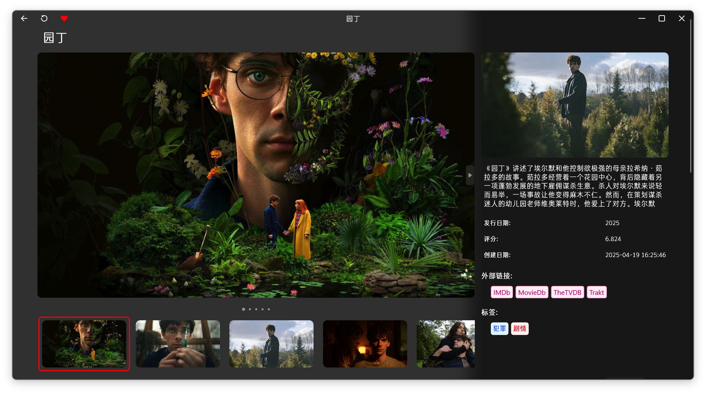
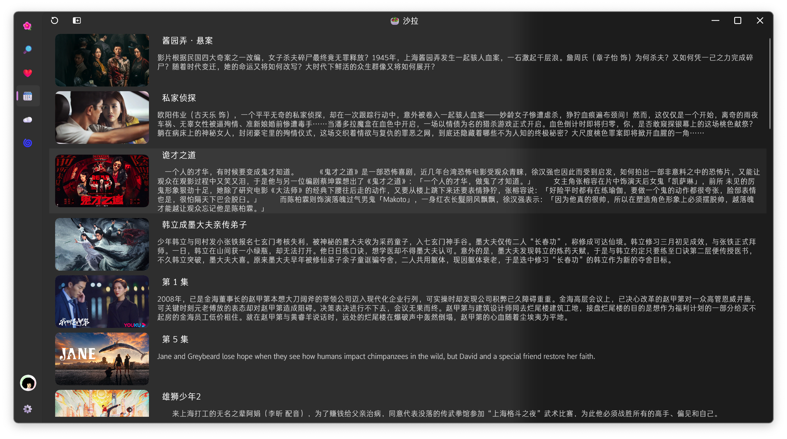

<h2 align="center">🎬 iPlay</h2>

iPlay is a modern video player for Android、 iOS、Windows and macOS

 

---

### 🌐 Play Anywhere, Anytime, On Any Device

<table style="overflow:visible">
<tr>
<td colspan="3">
</td>
</tr>
<tr>
<td></td>
<td></td>
<td></td>
</tr>
<tr>
</tr>
</table>

Supports `Android`, `iOS`, `MacOS`, `XBox` and `Windows`

### 🌟 Feature

- [x] Support Emby
- [x] Support Jellyfin
- [x] Multi-site switch
- [x] Use custom font
- [x] Support Windows
- [x] Audio player

### 🚧 Development Progress

It is developed in my free time ⏰

### 📥 Download

- [Android](https://github.com/saltpi/iPlay/releases/latest)
- [iOS](https://github.com/saltpi/iPlay/releases/latest)
- [Testflight](https://testflight.apple.com/join/73NHMoP6)

<table>
<tr>
<td> XBox </td>
<td> Windows </td>
<td> MacOS/iOS/tvOS </td>
<td> Android </td>
<td> Harmony </td>
</tr>
<tr>
<td>

</td>
<td>

</td>
<td>

</td>
<td>

</td>
<td>

</td>
</tr>
</table>

## 📚 Third-party Dependencies

### 📺 Player

- [mpv](https://github.com/mpv-player/mpv)
- [vlc](https://github.com/videolan/vlc)
- [exo](https://github.com/google/ExoPlayer)

### 📦 Utils

- [okhttp](https://github.com/square/okhttp)
- [lombok](https://github.com/rzwitserloot/lombok)

## 🎨 UI Design

- [Player UI Design](https://www.figma.com/file/2LMy996hxF2DZ2jB8eU0Fv/Video-Player-For-Web-%26-Mobile-(Community)?type=design&node-id=18-4120&mode=design&t=4xkVhM84OdC0jy9x-0)
- [Icon](https://www.figma.com/file/9Df5CaFUEomVzn20gRpaX3/Radix-Icons?type=design&node-id=0-1&mode=design&t=rpFwTmQyZQhc016k-0)
- [UI Element](https://www.figma.com/file/B5TV95tj8PrCHwsSa3wV0N/Flat-Icon-Set-(Community)?type=design&node-id=2092-13469&mode=design&t=w8YD9Lw37sz019zc-0)
- [Fluent UI System Icons](https://github.com/microsoft/fluentui-system-icons)

## 📣 Feedback & Communication

* 🧼 [iPlay product discussion group](https://t.me/iPlayClient)

* 🐞 Bug a report

## 💗 Sponsors
